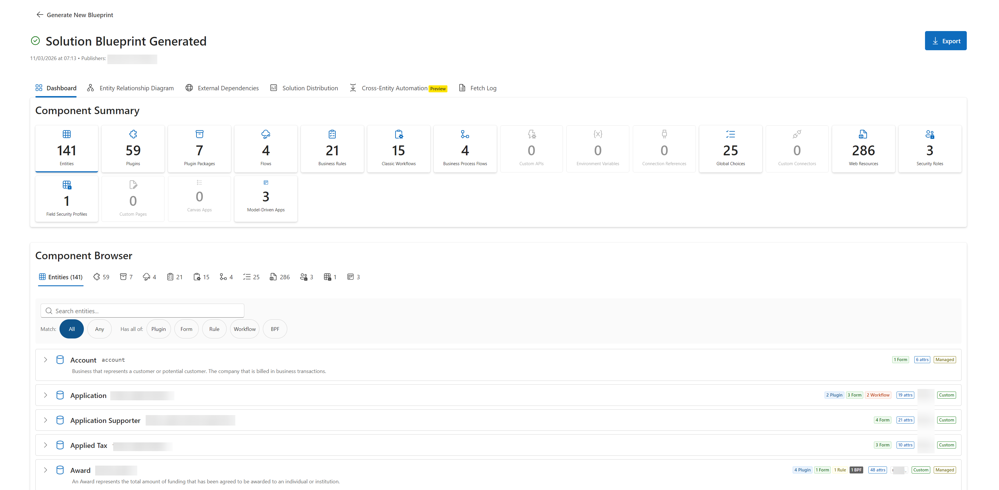
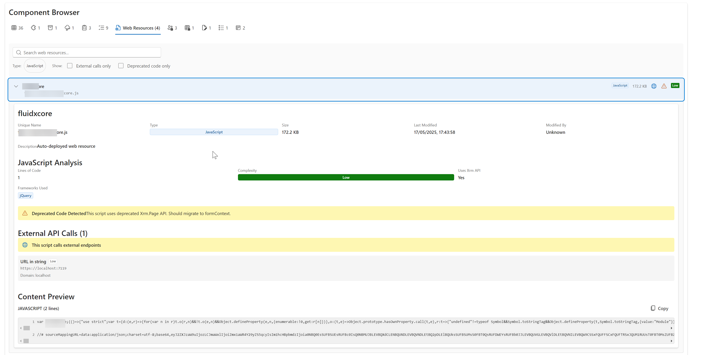

# Power Platform Solution Blueprint (PPSB)

> Complete architectural blueprints for your Power Platform solutions.


Generate comprehensive technical documentation for Dataverse and Power Platform solutions with automated discovery, analysis, and export capabilities.

---

## 🎯 What is PPSB?

**PPSB** is an automated documentation tool that generates complete architectural blueprints for Power Platform solutions. It discovers, analyzes, and documents your entire Dataverse environment—from entity schemas to automation pipelines—saving architects and developers hundreds of hours of manual documentation work.

The tool generates **comprehensive blueprints** including Entity Relationship Diagrams (ERD), complete entity documentation with automation execution pipelines, cross-entity automation mapping, external dependency analysis, and solution distribution breakdowns. All exports are production-ready: Markdown files ready for Azure DevOps Wiki, JSON for programmatic analysis, and self-contained HTML for stakeholder sharing.

PPSB benefits **solution architects** (system documentation), **developers** (onboarding and reference), **governance teams** (compliance and dependency tracking), and **consultants** (assessment and migration planning). Primary use cases include technical documentation generation, governance and compliance auditing, performance analysis, and migration planning.

---

## ✨ Key Features

<details>
<summary><b>📋 Discovery & Documentation</b> (click to expand)</summary>

- **Entities**: Complete schema (fields, relationships, keys, alternate keys)
- **Plugins**: Full registration details with execution order analysis
- **Power Automate Flows**: Trigger analysis, connection references, external calls
- **Business Rules**: Client-side and server-side with condition parsing
- **Classic Workflows**: Documentation with migration recommendations and risk assessment
- **Business Process Flows**: Stage and step documentation
- **JavaScript Web Resources**: Code analysis with external call detection and deprecated API warnings
- **Custom APIs**: Complete parameter documentation and privilege requirements
- **Environment Variables**: Value tracking critical for ALM
- **Connection References**: Premium connector detection for licensing
- **Global Choices**: Shared option sets with usage tracking
- **Security**: Roles, field security profiles, attribute masking, column security

</details>

<details>
<summary><b>📊 Analysis & Visualization</b> (click to expand)</summary>

- **Entity Relationship Diagram (ERD)**: Mermaid diagram with publisher color-coding and relationship types
- **Execution Pipeline**: Visual representation of client → sync → async automation flow per entity
- **Cross-Entity Automation** *(Coming Soon)*: Advanced analysis mapping automation across entity boundaries with plugin decompilation and workflow parsing
- **External Dependencies**: Detect and risk-assess all external API calls (flows, plugins, web resources)
- **Solution Distribution**: Component breakdown across solutions with dependency mapping
- **Entity Complexity**: Scoring based on field count, automation density, and relationship complexity
- **Performance Risks**: Identify synchronous plugins with external calls, long execution chains

</details>

<details>
<summary><b>💾 Export Formats</b> (click to expand)</summary>

- **Markdown**: Complete file structure ready for Azure DevOps Wiki upload
- **JSON**: Full data export for programmatic use, baselines, and CI/CD pipelines
- **HTML**: Single-page interactive document with navigation, search, and accordion sections
- **ZIP**: All formats bundled together with organized directory structure

</details>

<details>
<summary><b>🔍 Smart Scope Selection</b> (click to expand)</summary>

- **By Publisher**: Select one or more publishers to document all their solutions
- **By Solution**: Choose specific solutions regardless of publisher
- **By Entity**: Document all entities (with optional system entity inclusion)
- **Filtering**: Multi-select with live filtering and selected item management

</details>

---

## 🚀 Quick Start

1. **Install**: Add PPSB to your PPTB Desktop tools directory
2. **Launch**: Open PPSB from PPTB Desktop with an active Dataverse connection
3. **Select Scope**: Choose publisher(s), solution(s), or all entities
4. **Generate**: Click "Generate Blueprint" and wait for discovery and analysis
5. **Review**: Explore the interactive results with ERD, entity details, and automation analysis
6. **Export**: Download as Markdown, JSON, HTML, or ZIP bundle
7. **Use**: Upload Markdown to Azure DevOps Wiki or share HTML with stakeholders

📖 **[Detailed User Guide](docs/user-guide.md)** |
📊 **[Example Output Structure](docs/examples/example-output-structure.md)** |
🏗️ **[Architecture Documentation](docs/architecture.md)**

---

## 📸 Screenshots

### Scope Selection
Choose what to document - by publisher or solution with multi-select filtering.


### Confirmation Screen
Review your selection before generating the blueprint.


### Results Dashboard
Interactive dashboard with summary metrics, ERD visualization, and component browser.



### Component Details
Browse and explore all discovered components with expandable details and inline documentation.



### Solution Distribution Analysis
Analyze component distribution across solutions with dependency mapping and shared component detection.


### External Dependencies Analysis
Identify and assess all external API calls across flows, plugins, and web resources with risk scoring.


### Export Options
Choose your export format - Markdown, JSON, HTML, or ZIP bundle.


### HTML Export
Self-contained, interactive HTML documentation ready to share with stakeholders.


---

## 💡 Use Cases

### Architecture Documentation
- **Onboarding**: Generate complete system docs for new team members joining projects
- **Proposals**: Create technical specifications and architecture diagrams for client proposals
- **Handover**: Provide comprehensive documentation during project transitions

### Governance & Compliance
- **External Dependencies**: Identify all external API calls for security review and approval
- **Premium Connectors**: Track premium connector usage for accurate licensing compliance
- **Environment Variables**: Monitor configuration management and ALM readiness
- **Security Audit**: Document all security roles, field security, and data masking rules

### Performance Analysis
- **Bottleneck Detection**: Find synchronous plugins with external calls blocking transactions
- **Execution Chains**: Identify complex automation sequences that may cause performance issues
- **Optimization Planning**: Prioritize refactoring based on complexity scores and risk levels

### Migration Planning
- **Classic Workflow Assessment**: Identify all workflows requiring migration to cloud flows
- **Complexity Analysis**: Get detailed migration recommendations with step-by-step guidance
- **Dependency Mapping**: Understand cross-entity automation before migration

📖 **[More Use Cases in User Guide](docs/user-guide.md#common-use-cases)**

---

## 🔧 Technical Stack

- **Language**: TypeScript 5.x (strict mode)
- **UI Framework**: React 18 + Vite 5
- **Component Library**: Fluent UI v9 (Microsoft Design System)
- **Diagrams**: Mermaid (ERD and execution pipelines)
- **Export**: JSZip (multi-file packages)
- **Architecture**: Flat structure with separated core logic (`src/core/`) and React UI (`src/components/`)

🏗️ **[Architecture Details](docs/architecture.md)** |
🛣️ **[Roadmap](docs/roadmap.md)**

---

## 🚦 Installation

### For PPTB Desktop Users

1. Available in the PPTB Marketplace

### For Development

```bash
# Clone repository
git clone https://github.com/sabrish/power-platform-solution-blueprint.git
cd power-platform-solution-blueprint

# Install dependencies
pnpm install

# Run development server
pnpm dev

# Build for production
pnpm build

# Type check
pnpm typecheck
```

**Development Requirements:**
- Node.js 18+ and pnpm 8+
- PPTB Desktop for testing (connects to Dataverse)
- Windows, macOS, or Linux

---

## 📚 Documentation

Comprehensive documentation for all aspects of PPSB:

- **[User Guide](docs/user-guide.md)** - Complete usage instructions from scope selection to export
- **[Architecture](docs/architecture.md)** - Technical design, component structure, and extension points
- **[API Security](docs/API_SECURITY.md)** - Complete API reference, security considerations, and data access documentation
- **[Roadmap](docs/roadmap.md)** - Future versions (baseline comparison, CLI, CI/CD integration)
- **[Examples](docs/examples/)** - Sample outputs and documentation structure
  - [Output Structure](docs/examples/example-output-structure.md)
  - [Sample ERD](docs/examples/sample-erd.md)
  - [Sample Entity Documentation](docs/examples/sample-entity-doc.md)
- **[Changelog](CHANGELOG.md)** - Version history and release notes

---

## 🙏 Credits & Acknowledgments

### Development Team
- **Primary Developer**: [SAB](https://github.com/sabrish)

### AI Collaboration

This project was developed with significant AI assistance:

- **ChatGPT (OpenAI)**: Initial brainstorming, concept validation, feature ideation, and requirements exploration. Helped refine the vision for what PPSB should be and validated technical approaches.

- **Claude (Anthropic)**: Detailed architecture design, comprehensive implementation planning, and hands-on code development via **Claude Code**. Provided deep technical expertise for TypeScript/React implementation, Dataverse API integration, performance optimization strategies, and accessibility compliance.

The combination of AI tools accelerated development while maintaining high code quality and architectural consistency. ChatGPT helped explore possibilities and refine the product vision, while Claude provided meticulous technical implementation with thousands of lines of production-ready code.

**AI Development Approach:**
- Architecture designed through iterative collaboration with Claude
- Implementation executed via Claude Code (AI-assisted coding)
- Code reviews and optimization suggestions from both AI assistants
- Documentation structure and content refined with AI input

### Technology

- **PPTB Desktop** - [Power Platform Toolbox](https://www.powerplatformtoolbox.com/) (platform for PPSB deployment)
- **Microsoft Dataverse** - Data platform and APIs
- **Fluent UI** - Microsoft's design system and React components
- **Mermaid** - Diagram rendering engine for ERD and pipeline visualizations
- **TypeScript** - Language and type system
- **React** - UI framework
- **Vite** - Build tool and development server

### Open Source Libraries

- JSZip (ZIP file generation)
- React Router (navigation)
- Various TypeScript utilities and type definitions

### Community

Thanks to the Power Platform community for inspiration, feedback, and the collective knowledge that shaped PPSB's feature set and use cases.

---

## 🛣️ Roadmap Highlights

PPSB is under active development with exciting features planned:

**Baseline Comparison & Automation**
- Baseline comparison (load previous JSON and detect changes)
- Change detection with risk assessment
- Command-line interface (CLI) for automation
- CI/CD integration (GitHub Actions, Azure DevOps)

**Enhanced Analysis**
- Impact analysis ("What breaks if I delete this?")
- Unused component detection
- Business process mining
- Custom analysis rules

**Extended Platform Support**
- Canvas Apps (enhanced with screen analysis)
- Power Pages (forms, lists, Liquid templates)
- Customer Insights & Marketing (journeys, segments, email templates)
- Additional component types (30+ new types)

**Enterprise Features**
- Performance benchmarking
- Multi-environment comparison
- Multi-tenant support
- Advanced visualizations and AI-powered insights

📖 **[Full Roadmap](docs/roadmap.md)**

---

## 📄 License

[MIT License](LICENSE)

Copyright © 2026 SAB. All rights reserved.

---

## 💬 Support

- **Issues**: [GitHub Issues](https://github.com/sabrish/power-platform-solution-blueprint/issues) - Report bugs or request features
- **Discussions**: [GitHub Discussions](https://github.com/sabrish/power-platform-solution-blueprint/discussions) - Ask questions and share ideas
- **Documentation**: [docs/](docs/) - Comprehensive guides and examples

---

## 🌟 Quick Links

- [Installation](#installation)
- [User Guide](docs/user-guide.md)
- [Architecture](docs/architecture.md)
- [Roadmap](docs/roadmap.md)
- [Changelog](CHANGELOG.md)
- [Examples](docs/examples/)

---

**Made with ❤️ for the Power Platform community**
